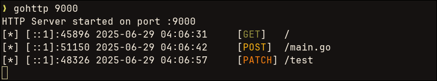

<p align="center">
  
</p>

# goHTTP 🍩

A tiny but mighty HTTP file server written in Go — serves files from any directory with colorful request logging, minimal setup, and zero dependencies.

This is a passion project of mine because honestly?  
Typing `python3 -m http.server` every time gets old — and this is faster.  
Yes, I'm aware `socat` exists — but let's not talk about *that* syntax.

---

## 🚀 Features

- 🔥 Blazing fast file server written in Go
- 🌈 Color-coded logs for request methods (GET, POST, etc.)
- ⏱️ Logs client IP, request time, method, and path
- 📂 Easily serve any directory you want
- 🔒 Port availability check before binding
- ⚙️ Simple CLI with optional directory override
- 🧠 Clean and hackable — perfect for red teaming, demos, or local dev

---

## 📸 Demo

<p align="center">
  
</p>

---

## 🧠 Usage

### 1. Build it

```bash
go build -o gohttp
```

### 2. (Optional) Install it globally

```bash
sudo mv gohttp /usr/bin/
```

### 3. Run it 

#### As a local installation or binary

```bash
# Serve current directory on default port 8000
./gohttp

# Serve current directory on custom port
./gohttp 9000

# Serve specific directory on custom port
./gohttp 9000 /path/to/dir
```

#### If installed to `/usr/bin` or globaly binary:

```bash
gohttp           # Serves current dir on :8000
gohttp 9000      # Serves current dir on :9000
gohttp 9000 /path/to/dir  # Serves Downloads on :9000
```
